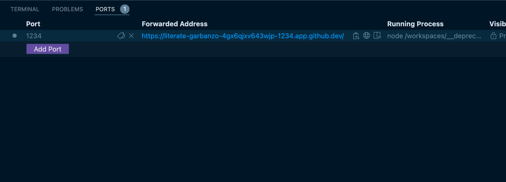
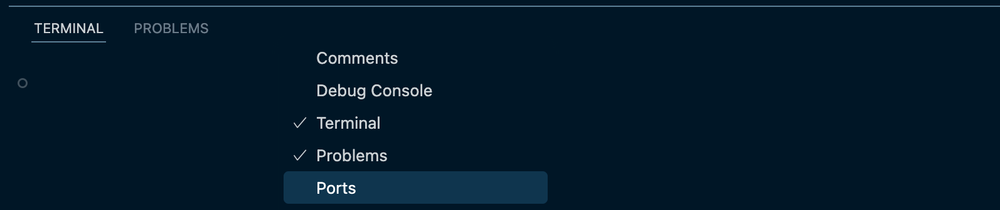
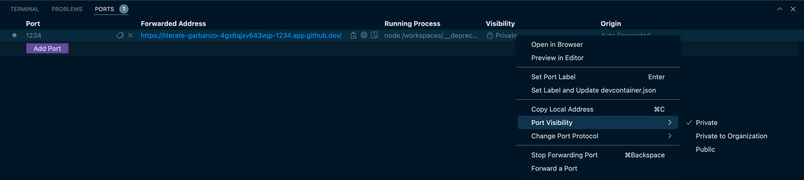
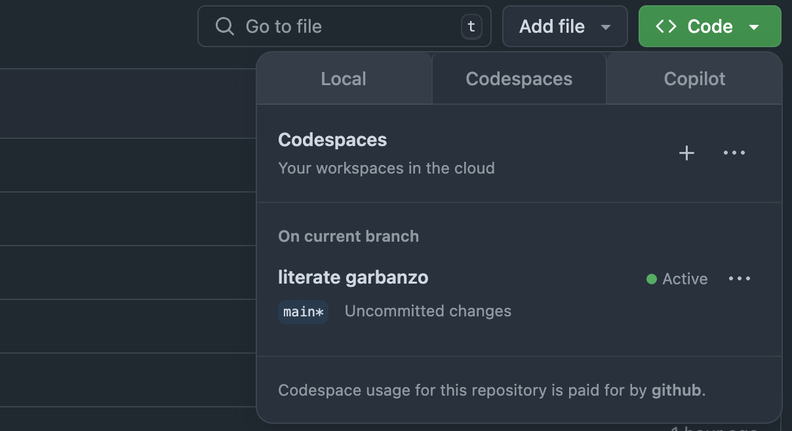
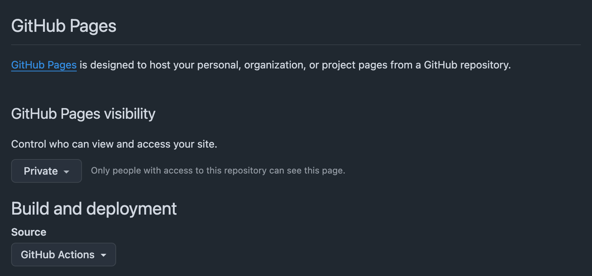
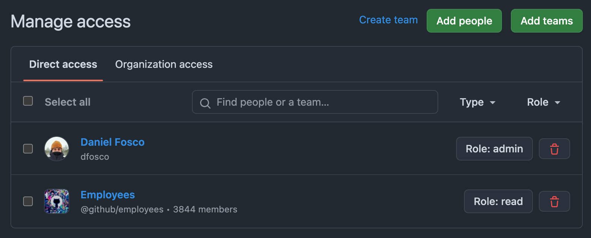
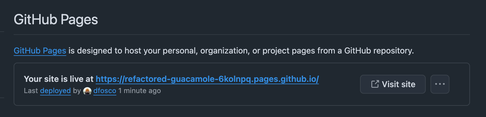

# Primer React Prototype ⚛️⚡

The easiest way to build a prototype from scratch with [Primer React](https://primer.style/react/) and deploy with GitHub Pages. 

Perfect for quick prototyping with code, and setup to be visible only for signed-in Hubbers. Works (mostly) out of the box!

*Built using [vite.dev](https://vite.dev/guide/), see their docs if you want to customize any configuration (you shouldn't have to).*

## Get Started (Quick setup - Codespaces)

<details>
<summary>
See instructions
</summary>

### Create a codespace

1. Create a codespace for your prototype by clicking **Use this template** > **Open in a codespace**

2. In the codespaces terminal, run:

```bash
npm install
```
```bash
npm run dev
```

Once `npm run dev` is running, go to the **PORTS tab** in the terminal and open the URL for your prototype:



If the **PORTS tab** is not visible for you, right-click next to the other tabs and enable it in the dropdown menu:



### Sharing your prototype

This is a temporary URL that's only live while `npm run dev` is running in your Codespace. 

To make the URL accessible for others, change its visibility: 

1. Go to **PORTS** tab
2. On the Visibility column, right click on **🔒 Private** 
3. Choose **Port visibility** on the dropdown
4. Change it to **Private to Organization**



To share a permanent URL, see [Get Started (Local development)](#get-started-local-development) below.

### Saving your codespace into a repository

If you try to `git push` from your codespace terminal, you will notice there is no repository associated with it.

To save your work, create a new empty repository owned by **@github** and set your codespace to it by running:

```bash
git remote add origin git@github.com:github/YOUR_REPO_NAME.git
git branch -M main
git push -u origin main
```

Once you have a repository saved, you should finish the configuration under [Deploying your prototype](#deploying-your-prototype).

You don't need to develop locally, however. You can always keep building in the browser, just choose the Coodespaces tab under the Code button:



</details>

## Get Started (Local development)

<details>
<summary>See instructions</summary>

### Start your repository
1. Create a repository for your prototype by clicking **Use this template** > **Create a new repository**

2. Set the repository Owner as **github** so that the deployment is only enabled for Hubbers. Choose whatever name you want.

3. Clone your new repo locally

### Developing

You need to have nodejs installed on your machine. If you don't, [head here](https://nodejs.org/en/download) and choose macOS installer.

Once you have the repository cloned on your machine, open the folder on VSCode or the terminal and run:

```bash
npm install
```

```bash
npm run dev
```

You will see the site running on http://localhost:1234

## Deploying your prototype

You need to change a few settings on GitHub.com for your prototype to be deployed & visible. This cannot be automated at the moment unfortunately!

1. Go to **Settings > Pages**:
   - Set GitHub Pages visibility to **Private**
   - Set Build and deployment source to **GitHub Actions**



2. Go to **Settings > Collaborators and teams**:
   - Click "Add teams"
   - Add **github/employees** with at least "Read" permission



3. Push your first commit after setting this up, and you will see your prototype available on an auto-generated URL under **Settings > Pages**. Share this URL with any Hubber and they will see it too!



  <details>
  <summary>Extra options</summary>

  - Add your Pages URL to the repository description:
    - On your repository homepage, click the gear (⚙️) icon next to **About** to edit the description
    - On the modal check **Use your GitHub Pages website**
    - Save changes, and your URL will be visible
  </details>

</details>

## Tips and Tricks

Use [Primer React](https://primer.style/components) components to build your layouts. 

To create new pages, duplicate any file in the `/pages` folder and rename it to `whatever.jsx`. Now head to `localhost:1234/whatever` and you will see your new page loaded

Also check out [this talk](https://www.youtube.com/watch?v=XroAmpITjsI) from [@heyamie](https://github.com/heyamie) for more tips on prototyping. Some parts are only relevant for NextJS projects, but a lot still applies!

## Dealing with errors

### `npm: command not found`

If you try to run `npm install` and get an error similar to the one above, that means you don't have Node/npm installed on your machine. In that case, [head here](https://nodejs.org/en/download) to download it (choose macOS installer for the simplest option).

### Any other error

Please open an issue or ping `@dfosco` on Slack! This repository is built to be a simple prototyping experience for designers and other non-developers. If it doesn't work out of the box, **the template is wrong, not you**. Let's fix it together 🙂
